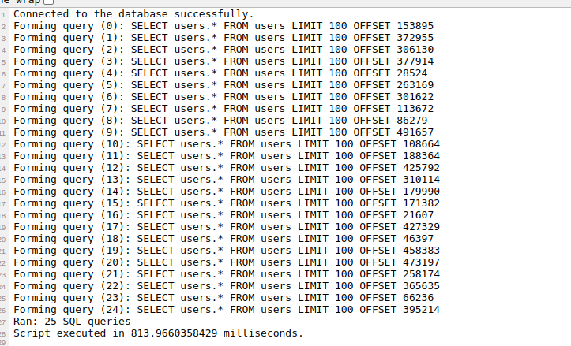
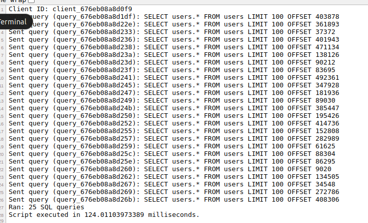

# Adding Asynchronous Querying to PHP with C++ ZeroMQ and SQL Server

## Introduction

In modern web development, achieving efficient and scalable systems often requires handling asynchronous operations. PHP, traditionally synchronous in nature, has seen efforts to introduce asynchronous capabilities. One such approach leverages a combination of a C++ ZeroMQ server for managing SQL queries asynchronously and integrating this system with PHP frameworks like Symfony and Laravel. This README explores the benefits of asynchronous querying for PHP applications and how it can be seamlessly integrated into Symfony and Laravel by modifying Doctrine and Eloquent ORM.

## Understanding the Role of Asynchronous Querying

### The Problem with Synchronous SQL Queries in PHP

PHP applications generally execute SQL queries synchronously, waiting for the query to complete before continuing with other operations. This approach limits performance and scalability, especially when:

- Queries involve complex joins or aggregations.
- The database is under heavy load.
- Real-time or near-real-time responses are required.

This synchronous behavior increases latency and reduces the number of concurrent requests a PHP application can handle.

### Why Asynchronous Querying?

Asynchronous querying allows applications to send SQL queries and continue executing other code without waiting for the database response. This capability:

1. **Improves Performance:** Non-blocking queries enable applications to handle more requests simultaneously.
2. **Enhances Scalability:** Resources are utilized more efficiently, especially in high-traffic scenarios.
3. **Enables Real-time Applications:** Applications such as chat systems, live dashboards, and notifications benefit significantly from asynchronous operations.

## Overview of `CppZeroMQAsynchSQLServer`

The `CppZeroMQAsynchSQLServer` repository demonstrates a robust way to implement asynchronous querying in PHP. Built using C++, ZeroMQ, and MySQL, the server processes SQL queries sent via ZeroMQ, executes them, and returns the results asynchronously.

### Key Features

1. **ZeroMQ for Communication:** Leverages ZeroMQ’s high-performance message queuing capabilities to manage communication between the server and clients.
2. **Asynchronous Query Handling:** Processes multiple queries simultaneously using a thread pool.
3. **Message Pack Response Format:** Responses are returned in message pack, making them easy to integrate with PHP frameworks.
4. **Connection Pooling:** Efficient management of database connections ensures optimal resource utilization.

### How It Works

- **Client Side:** PHP sends a query request to the C++ server via ZeroMQ.
- **Server Side:** The C++ server receives the query, executes it asynchronously, and sends back the result.
- **PHP Integration:** The response is handled asynchronously in PHP, enabling the application to process the data when it arrives.

## Integration into Symfony and Laravel

### Modifying Doctrine

To integrate asynchronous querying into Symfony, extend Doctrine’s Query Builder:

```php
$query = $entityManager->createQuery('SELECT u FROM User u WHERE u.status = ?1');
$query->setParameter(1, 'active');

// Send the query
$promise = $query->sendAsync();

// Perform other operations while the query is being executed
echo "Fetching user count...\n";
$userCount = $entityManager->createQuery('SELECT COUNT(u) FROM User u')->getSingleScalarResult();
echo "User count: $userCount\n";

// Later, fetch the results
$promise->fetch()->then(function($results) {
    foreach ($results as $user) {
        echo $user->getName();
    }
});
```

### Modifying Eloquent

For Laravel, extend Eloquent’s query builder:

```php
$promise = User::where('status', 'active')->sendAsync();

// Perform other operations while the query is being executed
echo "Fetching latest orders...\n";
$latestOrders = Order::latest()->take(5)->get();
foreach ($latestOrders as $order) {
    echo "Order ID: {$order->id}, Total: {$order->total}\n";
}

// Later, fetch the results
$promise->fetch()->then(function($users) {
    foreach ($users as $user) {
        echo $user->name;
    }
});
```

## Benefits of Asynchronous Querying

1. **Reduced Latency:** Applications can start processing other tasks while waiting for query results.
2. **Scalable Architecture:** Asynchronous operations reduce thread blocking, enabling more efficient resource utilization.
3. **Enhanced User Experience:** Faster responses and real-time updates improve overall user satisfaction.
4. **Flexibility:** Enables integration with modern event-driven paradigms, aligning PHP with trends in web development.

## Challenges and Considerations

1. **Debugging Complexity:** Debugging asynchronous code can be challenging due to its non-linear flow.
2. **Learning Curve:** Developers need to understand event loops, promises, and asynchronous programming.
3. **Server Setup:** Deploying and managing a C++ ZeroMQ server requires expertise beyond standard PHP environments.
4. **Compatibility:** Ensuring compatibility with existing database drivers and connection pooling mechanisms is essential.

## Real example

Build all the containers: "docker-compose -f docker-compose.yml up --build"

Sometimes the build will fail if the copy command does not complete before MakeFile runs if this happens run: "docker system prune -a"

Then run build command again if it failed.

In the app direcory of the project there are 2 files that can be run under apache:  standard.php and zeromq.php.


You can access these files at: http://127.0.0.1:8080/standard.php  and  http://127.0.0.1:8080/zeromq.php once you see the containers have built and the message 

cpp_server               | Database initialized and 500000 users added.

cpp_server               | Server is running on tcp://0.0.0.0:5555


The standard.php runs 25 select queries at random offset retrieving 100 records each query and simply outputs the sql statements usng standard mysql connector.

The zeromq.php rund the same outputting the same information but uses zeroMQ and the cpp_server to run the queries asynchronously.

The zeroMQ version using asynch queries runs about 650% faster than the synchronous version.

standard.php output:  Takes about 813 milliseconds



zeromq.php output:   Takes about 124 milliseconds



## Conclusion

Introducing asynchronous querying to PHP through a C++ ZeroMQ SQL server unlocks significant performance and scalability benefits. By modifying Doctrine and Eloquent, frameworks like Symfony and Laravel can seamlessly integrate this capability, enabling developers to build modern, real-time, and scalable applications.

While challenges exist, the potential benefits make this approach worth exploring. Asynchronous querying is a natural evolution for PHP, aligning it with modern web development trends and ensuring its relevance in the era of high-performance applications.

